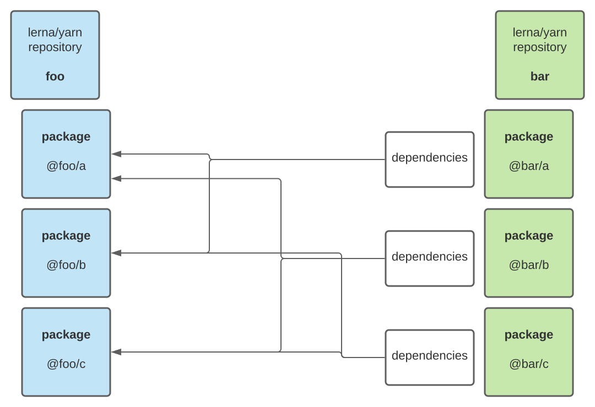

#### Syncer

Package can help sync packages versions in yarn mono-repositories.

Example:



You have 2 or more repositories: source (foo) and destination (bar).

Create in destination repository file: .syncerrc

```json
{
  "sources": ["../foo"],
  "fixedVersions": {
    "@foo/a": "1.2.1",
    "@foo/b": "1.2.1",
    "@foo/c": "1.2.1"
  }
}
```

### Usage:

```
syncer push
syncer pull
syncer auto
```
